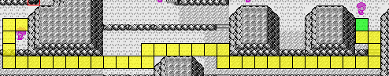
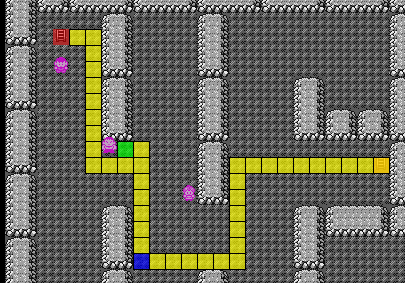
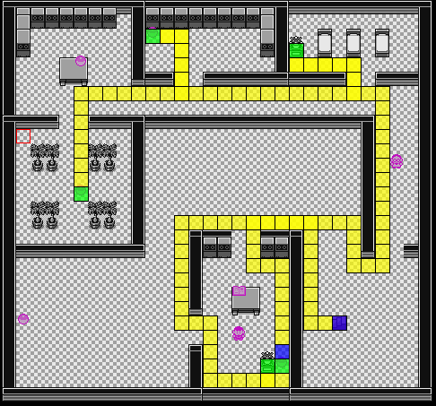

# Pokemon Red Glitchless Beginner Guide

## Pallet Town

**Rival 1:**
- Tail Whip, Tackle Spam

## Viridian City:
- Get XP from one encounter in route 1
  - During the parcel quest kill one encounter from a level 2 rat, level 3 rat, or a level 2 pidgey. You can fight level 3 pidgeys but you will take a bit of damage if you have a lower attack (10-11 at Lv6) squirtle. This Early XP will get you Bubble for Brock
- SHOPPING:
	- 4 Pokeballs 
- Nidoran Manip:  

- Get the tree potion here:  

## Viridian Forest:
- Walk this path in the forest and pickup the antidote along the way:  

**Bug Catcher:**
- Tail Whip x2, Tackle Spam [Heal if HP < 7]
- Check your leveled up stats:  
  | | |
  |-|-|
  |13 Special | **BAD** Special  |
  |14-15 Special | **GOOD** Special |
- If you are poisoned do the following:
	* Swap nidoran and squirtle (nidoran should be the lead pokemon)
	* Potion if HP < 16
	* Antidote

## Pewter City:
- SHOPPING:
	* 8 Potions
- If you weren't poisoned do the following:
	* Swap nidoran and squirtle (nidoran should be the lead pokemon)
  * Potion if HP is bellow 16
	* [OPTIONAL SAVE IF YOU HAVE BAD SPECIAL]

**Brock:**
* Geodude [Heal if HP < 8]
	- Swap to squirtle, then bubble spam
* Onix [Heal if HP < 7]
	- Swap to squirtle
		* IF ONIX USES BIDE: Tail Whip x2
	- Bubble Spam
- OPTIONS: Battle Style to Set before leaving Brocks Gym

## Route 3:
**Bug Catcher 1:**
* Caterpie: Leer + HA x2 + (Tackle)
* Weedle: Leer + HA x2
	- Leer + HA + Tackle if you got stringshot hit OR tackle will always kill
* Caterpie: HA x2 + Tackle
- Menu: Use a potion if HP < 25

**Shorts Guy:**
* Rat: [Heal if HP < 17]
	- Leer + HA x2
* Ekans: [Heal if HP < 6]
	- Leer + HA x2
		* Potion if you were bind and HP < 12 (20 if rat used tailwhip)

**Bug Catcher 2:** [Heal on caterpie if HP < 7]
* HA Spam all pokes finish pokemon with tackle when possible
- Menu: Use a potion if HP < 21

**Lass:** (This route also fights the optional lass)
- HA x4

**Bug Catcher 3:**
* Caterpie:
	- PS x2 (HA turn 2 if PS won't kill and didn't get turn 1 string shot hit)
* Metapod:
	- HA, PS, HA, PS (You really want at least 1 HA after this fight, if you are at 1 HA just PS)
  - Catch a Flyer
* Tackle then toss a ball at any flyer expect level 8s where you HA then toss a ball
- Kill one encounter in the grass with HA EXCEPT level 3 or level 7 jigglypuffs to get nidoran to level 15

## Mount Moon
**Mount Moon Manip:**

Don't stress too much doing the longer manips just learn Post Nerd Backup Paras and start working on a full moon manip. If you fail the manip just keep going and do the backup paras. There is also a 2nd floor backup you can learn
- [Inside Moon](https://pastebin.com/jnj9j47S) (Optimal for this route)
- Backups (in case you fail the full manip):
  - [2nd Floor Backup (PoY v2.0)](https://pastebin.com/j5gtY4cy)
  - [Post Nerd Backup Paras](/gen-1/red-blue/main-glitchless/resources/postnerd-backup-paras)

- Get TM 12 (Water Gun), Rare Candy, Escape Rope, TM 01 (Mega Punch), Moon Stone during mount moon manip
- MENU after Paras and Before Rocket:
	* Toss any remaining Pokeballs (ONLY IF YOU HAVE A PARAS)
	* Toss Antidote if you still have it
	* Use Rare Candy
	* Teach TM 12 (Water Gun) over Tackle (Slot 2)
	* Use Moon Stone
	* Teach TM 01 (Mega Punch) over Leer (Slot 1)

**Rocket:**
* Rat: MP
* Zubat: MP + PS (HA if zubat uses leech life and use MP if leech life also crits)

**Super Nerd:** (HA when possible but if you are out just MP again)
* Grimer: MP + HA [Note: Water Gun can kill if you get a good MP roll, if so use WG over MP or HA]
* Voltorb: MP + (PS)
* Koffing: MP + HA

## Nugget Bridge

- Use the Center
- Get IT (Instant Text)
  - you talk to the bike salesman and mash B through his text, this will set all text to instant. Things that kill instant text are Yes/No textboxes, opening the menu in and out of fights.
- Pickup the Hidden rare candy [here](http://gunnermaniac.com/pokeworld?map=1#235/44)

**Rival:**
* Pidgeotto: HA x3 (If you get some bad rolls use MP to kill)
	- If you get hit by 2 sand attacks swap to Squirtle and let it die
      - Try to put Pidgeotto in HA range before doing this: doing so avoids getting a chance to get sand-attack again after swapping back
* Abra: HA
* Rat: MP
* Bulba: MP + HA (If you get growled or miss a bunch into leech seed healing, you want to kill with MP)

**Fight 1:**
* MP + (PS) (If you missed MP on caterpie into String Shot Hit use HA)
* MP (If you missed MP got a String Shot Hit use HA)

**Fight 2:**
* MP + (PS)
* HA x2

**Fight 3:**
* MP
* MP
* HA

**Fight 4:**
* MP + (PS)
* HA x2

**Fight 5:**
* HP < 8:
	- MP + (PS) [Note: MP is a range to kill, so healing is an option but is slow cause you lose IT]
* 8 <= HP <= 27:
  - HA x2 [Note: Poison Sting can kill if you get a good HA roll, if so use PS over the second HA]
  - [Note: Mankey is 1/3 to Karate Chop and does 12-15, healing is an option but is slow cause you lose IT]
* HP > 27:
  - MP + (PS)

**Rocket:**
* Ekans: MP
* Zubat: HA

## Route 25:
**Bottom Hiker 1:**
- WG

**Female Junior 1**
* MP
* HA x2

**Bottom Hiker 2:**
* WG
* WG
* MP + (PS)
* WG

**Female Junior 2:**
* MP
* NOTE: You will learn Thrash here, teach it over Water Gun (slot 2)
* Thrash

Pickup Ether here: http://gunnermaniac.com/pokeworld?map=1#288/3
- MENU After Bill:
	* Use Rare Candy
	* Use Escape Rope

## Cerulean City:
- Center unless you have 55+ HP and at least 2 Mega Punches
- Get IT again

**Rocket:**
- Thrash

**Female Junior (inside gym):**
-  Thrash

**Misty:**
- Thrash
  - If you are ever alive and confused swap to another poke (bird) and let it die

If HP < 15:
* Potion
* Teach BB over PS
* Get IT again

## Vermilion City:
**Female Jr:**
- Thrash

**Male Jr:**
- Thrash

If HP < 13
- Potion
- Teach BB over PS (slot 4)

**Rival:**
- Pidgeotto: HA x2
	* If you get sand attacked swap to another pokemon and let it die
* Rat: MP
* Kadabra: Thrash

If you have less than 9 HP and IT, Fight the Gentleman with thrash then pickup the rare candy in this room here:  

**Shopping:**
* Buy:
	- 4 Repels
	- 4 Para Heals
- MENU Before cut brush:
	* Teach TM 11 (Bubble Beam) over PS (slot 4)
	* [Rare Candy if you fought the gentleman]
	* Teach HM 01 to Paras
	* Teach TM 28 (Dig) to Paras
	* Use Cut
- Surge Cans Manip:  

  

**Surge**
* Voltorb:
	- If you have less than 21 HP Thrash, if you are ever confused swap to the bird and let it die
	- Otherwise BB + HA
* Pikachu:
	- Thrash
- Get the Bike Voucher and use Dig on Paras

## Cerulean City
- Get the Bike
- MENU:
	- Swap (using select) Slot 1 with the Bike
	- Teach TM 24 (Thunder Bolt) over HA
	- Use the Bike

## Route 9

  
**First Girl:**
  - MP
  - Thrash
    - If you run out of mega punches without killing the first poke just Thrash you will be 25% to hit yourself on the last poke

  
**Bug Catcher:**
- BB
- Thrash

Avoid the next two trainers:  

You can pass the Female Jr before Rock Tunnel entrance without being seen from a tile right of the wall:  

## Rock Tunnel

  
**MENU (After taking 1 step down):**  
- Scroll down and use a Repel

**Slowpoke Dude 1:**
- BB
- TB

**Slowpoke Dude 2:**
- TB

[Optional Save if you are bellow 18 HP]

**Oddish Girl:**
 - If you have 18 - 22 HP:
  - TB, then Thrash
- Otherwise, just Thrash
- If you get para'd use a heal on it, and if you get put to sleep heal if absorb kills

Use one repel [here](https://gunnermaniac.com/pokeworld?map=232#25/19) (blue tile)

  
  
Use another repel [here](https://gunnermaniac.com/pokeworld?map=232#8/17) (blue tile)

**Hiker:**
- BB x3

  
**Lass:**
- Thrash

## Route 8
  
**Gambler:**
* Growlithe:
	- If you have less than 5 HP Potion
	- BB
* Vulpix: Thrash

## Underground
  
- Get the Hidden Elixer
- Get the Hidden Nugget:  

## Celadon City
Shopping:
* Floor 2:
  - Sell TM 34 (Bide)
  - Sell Both Nuggets
  - Buy TM 07 (Horn Drill)
  - Buy 9 Super Repels
  - Buy 4 Super Potions
  - Buy 2 Revives
* Floor 4:
	- Buy Pokedoll
* Roof:
	- Buy a Soda Pop and trade it to the girl
	- Come back and buy a Fresh Water
* Floor 5:
	- Buy 12 X Accs
	- Buy 7 X Specs
	- Buy 2 X Speeds
- Take the Elevator and get HM 02 (Fly)
- MENU after getting Fly:
	* Swap slot 2 with TM 07 (Horn Drill)
	* Use a Super Repel
	* Teach TM 48 (Rock Slide) over Mega Punch
	* Swap slot 4 (S.S. Ticket) with X Accs
	* Teach HM 02 to the bird
	* Use Fly to go to Lavender

## Lavender Town
NOTE: From this point on you have 2 revives which means deaths aren't as scary, so if you die remember to swap to a pokemon, revive, let the swapped pokemon die and ANY AND ALL X ITEMS ARE GONE. This route has extras so you shouldn't run out of x items, and there will still be some saving since some deaths with revives are still really slow to come back from if at all

<table>
	<tbody>
		<tr>
			<td>

			</td>
			<td>
			
**Rival**
- TB x2, BB, Thrash
 
			</td>
		</tr>
		<tr>
			<td>

			</td>
			<td>
			</td>
		</tr>
		<tr>
			<td>

  
			</td>
			<td>

**Channeler 1:**
- RS x2

Get the Elixer
			</td>
		</tr>
		<tr>
			<td>

  
			</td>
			<td>
			
Get the Elixer
			</td>
		</tr>
		<tr>
			<td>

  
			</td>
			<td>
			
**Channeler 2:**
  - RS

**Channeler 3:**
  - RS

Pickup the rare candy in your way  
Teach TM 07 (Horn Drill) over Rock Slide

**Ghost Encounter:**
- MENU:
	* Swap slot 4 with Super Repels
	* Use Pokedoll

 
			</td>
		</tr>
	</tbody>
</table>

<!--   
**Rival:**
- TB x2, BB, Thrash

  
  
**Channeler 1:**
- RS x2

Get the Elixer

  
Get the Elixer

  
**Channeler 2:**
- RS

**Channeler 3:**
- RS
- Pickup the rare candy in your way
- Teach TM 07 (Horn Drill) over Rock Slide

**Ghost Encounter:**
- MENU:
	* Swap slot 4 with Super Repels
	* Use Pokedoll -->

NOTE: go in a straight line with the rocket guys, do not bother talking with them avoiding the exclamation mark bubble.

**Rocket 1:**
- TB x3 + (BB)

**Rocket 2:**
- X ACC, HD x2

**Rocket 3:**
- TB x2, Thrash

Get the Pokeflute and Fly to Celadon City

## Celadon City
- Use the Center
- Bike to Saffron City

## Saffron City
<table>
	<tbody>
		<tr>
			<td>
			</td>
			<td>

Enter Silph Co and take the stairs to floor 5
			</td>
		</tr>
		<tr>
			<td>

			</td>
			<td>

Get the Hidden Elixer [here](http://gunnermaniac.com/pokeworld?map=210#12/3)

**Rocket 1:**
- Thrash
  - If you get paralized use a heal

Get the Key Card
			</td>
		</tr>
		<tr>
			<td>

  
  

			</td>
			<td>

NOTE: take that step up after teleporting in the Rival room in order to avoid the rival walking around you to exit in his very swag way.

**Rival:**
- Pidgeotto:
	- X Acc
	- X Speed, HD
- HD all remaining Pokes

If you have less than 78 HP use ether on HD before the next fight

NOTE: In this split we want to take a bit of damage to do a strat on Koga called Boom strats  
			</td>
		</tr>
		<tr>
			<td>

			</td>
			<td>

**Rocket 2:**
* Cubone:
  - Turn 1: X Acc
  - Turn 2: If Cubone damages you and you need to ether still use ether now
  * BB
* Drowzee:
	- If you haven't used ether do so now
	- HD
* Marowak: HD

**Giovanni:**
- X Acc, HD x2, BB, HD

Go back to the elevator and go to the 10th Floor 
			</td>
		</tr>
		<tr>
			<td>

			</td>
			<td>

On 10th floor get **TM 26 (Earthquake)** and the **Rare Candy**

Use Dig on Paras
			</td>
		</tr>
	</tbody>
</table>

<!--
- Enter Silph Co and take the stairs to floor 5
- Get the Hidden Elixer [here](http://gunnermaniac.com/pokeworld?map=210#12/3)

**Rocket 1:**
- Thrash
  - If you get paralized use a heal
- Get the Key Card

**Rival:**
* Pidgeotto:
	- X Acc
	- X Speed, HD
* HD all remaining Pokes
- NOTE: In this split we want to take a bit of damage to do a strat on Koga called Boom strats
- If you have less than 78 HP use ether on HD before the next fight

**Rocket 2:**
* Cubone:
  - Turn 1: X Acc
  - Turn 2: If Cubone damages you and you need to ether still use ether now
  * BB
* Drowzee:
	- If you haven't used ether do so now
	- HD
* Marowak: HD

**Giovanni:**
- X Acc, HD x2, BB, HD
- Go back to the elevator and go to the 10th Floor to get [TM 26 (Earthquake)](https://gunnermaniac.com/pokeworld?map=234#2/12) and the [Rare Candy](https://gunnermaniac.com/pokeworld?map=234#4/14)
- Use Dig on Paras
-->

## Celadon City
- Use your Bike and go to Snorlax
- MENU before Snorlax:
	* Use Super Repel
	* Swap slot 5 for Rare Candies
	* Use Pokeflute

## Cycling Road

| | |
|-|-|
|| Get the Rare Candy |

## Fuschia City
* MENU:
  * Super Repel
  * Swap slot 6 with X Spec
  * Teach TM 26 (Earthquake) over Thrash
  * Use Bike

In the Safari Zone:

| | |
|-|-|
|| |
|| If you have 0 potions get the full restore in the blue path |
|| Super Repel in green tile |
|| Pickup the Teeth and get Surf |

After getting Surf, dig out of the safari (from outside the house) and fly back to Fuschia city.

Bike to Koga gym.

<table>
	<tbody>
		<tr>
			<td>

			</td>
			<td>

**Juggler 1:**
- EQ x4

**Juggler 2:**
* Drowzee: EQ
* Hypno: EQ + TB
  - if TB gets disabled, finish with BB if it's in range, finish with EQ if not or you don't know the range

**Koga:**
- EQ x3
- Elixer on Weezing
  - if Koga used x attack use Bubblebeam till you die
  - if you didn’t die from koga you can still try to get red bar by following the HP strats for the [backups](https://pastebin.com/2DBBnkmf). Note that this can be risky
 
			</td>
		</tr>
	</tbody>
</table>

<!--
**Juggler 1:**
- EQ x4

**Juggler 2:**
* Drowzee: EQ
* Hypno: EQ + TB
  - if TB gets disabled, finish with BB if it's in range, finish with EQ if not or you don't know the range

**Koga:**
- EQ x3
- Elixer on Weezing
  - if Koga used x attack use Bubblebeam till you die
  - if you didn’t die from koga you can still try to get red bar by following the HP strats for the [backups](https://pastebin.com/2DBBnkmf). Note that this can be risky
-->
- MENU After Koga:
	* Use all Rare Candies
	* Bike to get Strength
- Fly to Pallet town
- MENU at the bottom left of the water:
	* Super repel
	* Teach HM 03 (Surf) to Squirtle
	* Surf
	  * Turn a tile left when near the fisherman and surf down untile Cinnabar Island

## Cinnabar Island:

<table>
	<tbody>
		<tr>
			<td>

 

			</td>
			<td>

Get to the 3rd floor and push the switch, then fall back to 1st floor.
			</td>
		</tr>
		<tr>
			<td>

 
 
			</td>
			<td>

Get to B1:
- Pickup TM 14 (Blizzard)
- MENU:
	* Teach HM 04 (Strength) to Squirtle Over Tackle
	* Teach TM 14 (Blizzard) over BB
	* Use REPEL (NOTE THIS IS THE **REPEL** NOT I REPEAT NOT SUPER REPEL)
* Pickup the Rare Candy
* Pickup the Secret Key
* Dig out
 
			</td>
		</tr>
	</tbody>
</table>

## Celadon City
- Bike to the Gym

<table>
	<tbody>
		<tr>
			<td>

 
			</td>
			<td>

Be careful avoiding the leftmost beauty.

**Beauty:**
- Bliz

**Erika:**
- EQ, Bliz, EQ
- After Erika Fly back to Cinnabar
 
			</td>
		</tr>
	</tbody>
</table>

## Cinnabar Island
- Quiz Answers: A B B B A B

**Blaine:**
* Growlithe: X ACC, EQ
* HD all remaining pokes

Dig out and Bike to Sabrina's Gym

## Saffron City
- Teleporter Puzzle: Top Left, Bottom Left, Bottom Left

**Sabrina:**
- EQ x4
- Walk back to the Teleporter and dig out and fly to  

## Viridian City

<table>
	<tbody>
		<tr>
			<td>

 
			</td>
			<td>

**Cooltrainer:**
- EQ

[OPTIONAL SAVE: This next fight has a decent chance to die, and reviving will lose red bar so saving is advised]

**Blackbelt:**
- X ACC, HD, Bliz, HD
- Leave the Gym to reset the trainer
- MENU after entering the gym again:
  - Elixer

**Giovanni:**
- EQ x4, Bliz + (Bliz)
	* Note: Don't go bellow 2 Blizzards in this fight, if you need to use EQs to finish Rhydon
 
			</td>
		</tr>
	</tbody>
</table>

MENU after leaving the gym:
* Super Repel
* Bike

**Rival:**
- X ACC, X Spec, Bliz, Bliz, TB, X Spec, TB, EQ, Bliz
	* Note: If you only have 2 Blizzards, use TB on Pidgeot instead of Bliz

## Route 23

Use Super Repel after the water path

## Victory Road

<table>
	<tbody>
		<tr>
			<td>

 
			</td>
			<td>
Use Strength whenever you want, then move the boulder
			</td>
		</tr>
		<tr>
			<td>

  
			</td>
			<td>
Go next to the boulder, use Super Repel, then Strength, then move the boulder
			</td>
		</tr>
		<tr>
			<td>

  
			</td>
			<td>

Use Strength after the stairs then move the boulder.
			</td>
		</tr>
		<tr>
			<td>

  
			</td>
			<td>

* Push the boulder into the hole.  
* Fall into the hole.  
* MENU:
  * Use Super Repel
  * Use Strength
* Move the boulder to the left
 
			</td>
		</tr>
		<tr>
			<td>

  
			</td>
			<td>

- Exit the Victory Rode
- Optional Safety: Pickup the Full Restore [here](http://gunnermaniac.com/pokeworld?map=194#26/7)
 
			</td>
		</tr>
	</tbody>
</table>

## E4
- Don't extra pokes deposit unless you have no more revives

**Lorelei:**
* Dewgong:
	- Swap to the Bird turn 1
	- Swap back to Nido and X ACC then HD
	* HD all remaining Pokes
- Before Bruno use an Elixer

**Bruno:**
- X ACC, Bliz, HD x2, Bliz, HD

MENU before Agatha:
* Super Potion with 19 or more HP
* Super Potion + Potion with 18 or less HP
  - if out of potion, just Super Potion once
* Rare Candy

**Agatha:**
* Gengar: X Spec, EQ
  - If you get put to sleep use the pokeflute, and if you get confused risk it since you would need to X Spec again if you swapped)
* Golbat: Bliz
    - If you miss Bliz, and Golbat uses Haze, use
      - 2x TB on Golbat
      - X Speed on Arbok with 25-60 HP
      - skip X Speed (you will be slower than last Gengar) with less than 25 or more than 60HP
    - If you miss Bliz, but Golbat doesn't use Haze, use Bliz again
	* EQ all remaining Pokes

MENU Before Lance:
* Heal using the bellow chart
* Use Elixer
* [OPTIONAL SAVE: Lance is pretty likely to go bad, so saving is recommend]

HP | ITEMS
-- | -----
4-6 | Super Potion x2 + Potion x2
8-26 | Super Potion x2 + Potion
27-48 | Super Potion x2
49-56 | Super Potion + Potion x2
57-76 | Super Potion + Potion
77-98 | Super Potion
99-106 | Potion x2
107-126 | Potion

If you don't have enough Potion, use the heal option below
  - Feel free to use your Full Restore if you picked it up and you want to play really safe

**Lance:**
* Gyarados: X Spec, TB
* Dragonair 1: Bliz
* Dragonair 2: X Speed, Bliz
  - If you are out of X Speeds use an X Spec
* Aero: TB
* Dragonite: Bliz

[OPTIONAL SAVE: Saving for Champ can be good if you don't have a spare X Accuracy+ spare X Special + Revive]
* Heal below at 22HP or below
  - Can also heal below at 44HP or below if you want to play safer

**Champ:**
- X Spec, X Acc, HD x3, TB, HD x2
	* If Pidgeot uses Sky Attack turn 1 do the following:
	 - Bliz, EQ, X Acc, HD x4
